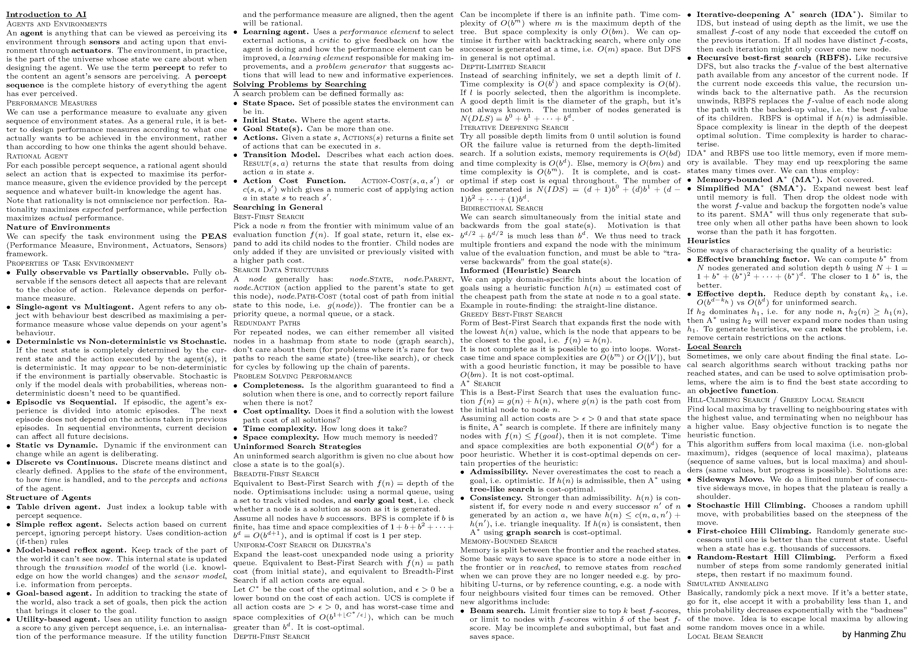
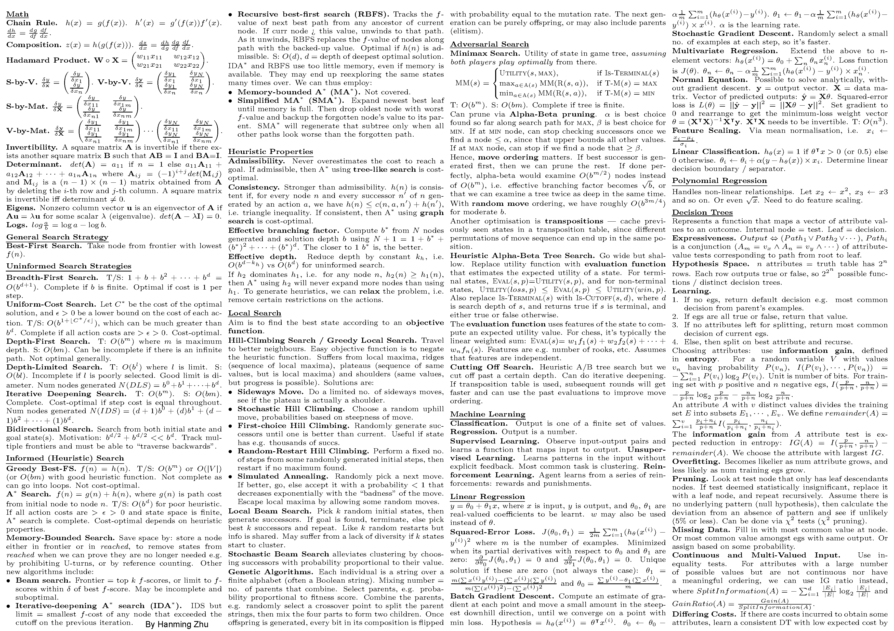

<!-- markdownlint-disable MD036 MD033 -->

# CS2109S - Introduction to AI and Machine Learning (Cheatsheets)

_Taught by Dr Ben Leong, AY21/22 Semester 2_

    

<em>Midterms cheatsheet contains content on Search Algorithms and part of Machine Learning.</em>

    

<em>Finals Cheatsheet</em>

<em>Be warned that these cheatsheets may not be very applicable, as Prof Ben is known for testing practical applications and understanding over content knowledge and memorisation.</em>

## Concepts Covered

- Uninformed and Informed Search
- Heuristics
- Adversarial Search
- Decision Trees
- Linear Regression and Gradient Descent
- Polynomial Regression
- Logistic Regression
- Model Selection
- Regularisation
- Support Vector Machines
- Multi-Layer Neural Networks
- Deep Neural Networks
- Clustering and Unsupervised Learning
- AI Ethics
